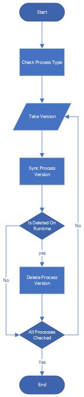

# Overview

The **CD Process Cleanup** Postman collection provides an automated solution for cleaning up outdated process versions in your environment. The collection includes requests for identifying process versions by type or environment and removing those no longer in use. This ensures that your environment remains clean and optimized.

## Key Features
- **Process Version Cleanup**: Detects and deletes outdated process versions based on type and environment.
- **Environment Synchronization**: Ensures synchronization between process versions and their published states in different environments.
- **API Authorization**: Uses OAuth 2.0 for authorization via client credentials.

## Collection Structure

This collection is divided into two main sections:

1. **Cleanup by Process Type**:
    - **Check Process Type**: Checks for process versions based on a specified process type (`processType`). The script ensures no cleanup is attempted on processes that are the only version for a given type.
    - **Sync Process Version**: Syncs the information for each process version to determine whether it can be deleted.
    - **Delete Process Version**: Deletes a process version if it is not published to any environment.
    - **Stop Process Cleanup**: Stops the cleanup once all unnecessary versions have been removed.

Since there might be multiple process versions to be deleted, this section iterates until all deletable processes are deleted. 
The chart below shows the logical flow of this section:

> **Note**: This sample works only if all registered environments are available 

2. **Cleanup by Environment**:
    - **Find Environment**: Retrieves information about the specified environment.
    - **Find Process Versions**: Identifies all process versions published to a specific environment.
    - **Sync Environment**: Syncs the process versions with the environment to ensure no published versions are deleted.
    - **Delete Process Version**: Deletes process versions from the environment if they are no longer required.
    - **Stop Environment Cleanup**: Ends the cleanup process once outdated versions have been removed.

Since there might be multiple process versions to be deleted, this section iterates until all deletable processes are deleted. 
The chart below shows the logical flow of this section:

## How to Use

### Step 1: Set Up Environment Variables
- Define the required environment variables before running the collection:
  - `APIHeader`: The authorization header key.
  - `APIKey`: The API key or token.
  - `DTUrl`: The base URL of the API.
  - `processType`: The GUID of the process type to be cleaned.
  - `environmentID`: The ID of the environment for environment-specific cleanup.

### Step 2: Run the Collection
1. Open the Postman collection and ensure your environment variables are correctly configured.
2. Run the requests in sequence using the **Collection Runner** to ensure proper process detection and deletion.

### Step 3: Customize as Needed
You can modify the scripts to handle specific edge cases or adjust the cleanup logic based on your process and environment structure.
